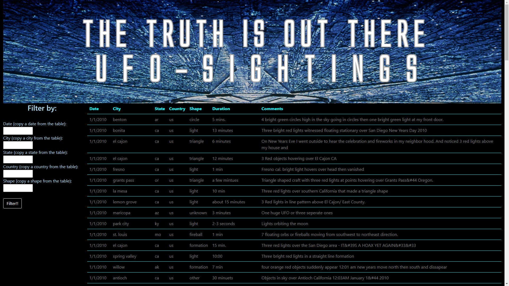
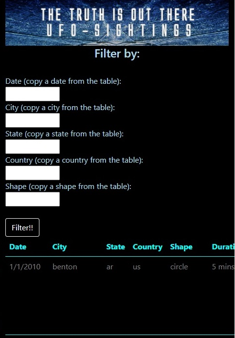

# **JavaScript-challenge**

## *Project Overview*

This project consists on creating a dynamic webpage that will pull data related to UFO sightings. The project will be divided in 2 parts, first part will allow to search for sightings by date. The second part will expand the filter capabilities and will implement filter by date, location, etc.

## *Project breakdown*

- To start I will create the general layout of the webpage using HTML, CSS and [Bootstrap](https://getbootstrap.com/)
- Now, by using Javascript the app will pull the data provided about UFO sightings in order to be able to work with it
- Next I created a function that takes a variable date, uses that date to filter the data and displays the results in the webpage
- After testing the funcionality of the script I added some styling to the results with a custom header image, [Bootstrap](https://getbootstrap.com/), and css
- That is it for part I of the project
- For the part II I used the backbone already created in part I and reformatted the logic
- Part II contains listeners for all input texts but added some conditionals, the function will only filter if the corresponding input box has a value
    - It is important to note that if the filter string is invalid (i.e. does not exist in the data) the app will yield an empty result

## *Repository structure*
````bash
│   .gitignore
│   commits.md
│   LICENSE
│   README.md
│
├───UFO-level-1
│   │   index.html
│   │
│   ├───images
│   │       id4.jpg
│   │
│   └───static
│           data.js
│           index.js
│           style.css
│
└───UFO-level-2
    │   index.html
    │
    ├───images
    │       id4.jpg
    │
    └───static
            data.js
            index.js
            style.css
````

## *Final webpage result*
- Full screen size



- Small screen size

